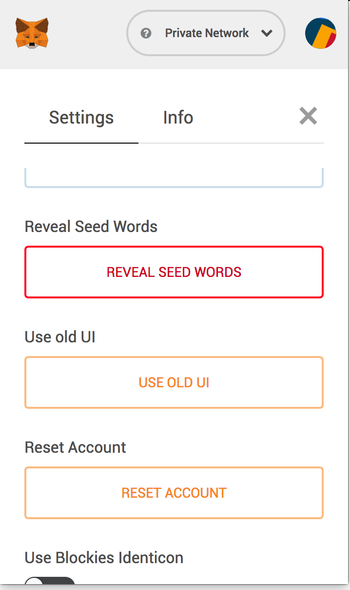

# Installation

- Install ganache https://truffleframework.com/ganache
- start Ganache UI

```
yarn install
truffle migrate
```

# Demo


# Development
## Start the app

1. Install Metamask
1. Connect Metamask to local RPC 

1. Comple and migrate contract

```
truffle compile
truffle migrate
```
1. Start the web client
```
cd client
yarn start 
```


To run
```
truffle console
```

## Ropsten

1. Update configuration

```
cp config.yml.sample config.yml
```

Update config.yml to populate your 12 words mnemonic.
In meta mask, you can get the mnemonic here:



1. Comple and migrate contract

```
truffle migrate --network ropsten
```

1. Start the web client
```
cd client
yarn start
```

## Tests

To run automated tests

```
truffle test
```

# Useful links

https://ethereum.stackexchange.com/questions/13167/are-there-well-solved-and-simple-storage-patterns-for-solidity
https://michalzalecki.com/ethereum-test-driven-introduction-to-solidity/
https://medium.com/blockchannel/the-use-of-revert-assert-and-require-in-solidity-and-the-new-revert-opcode-in-the-evm-1a3a7990e06e